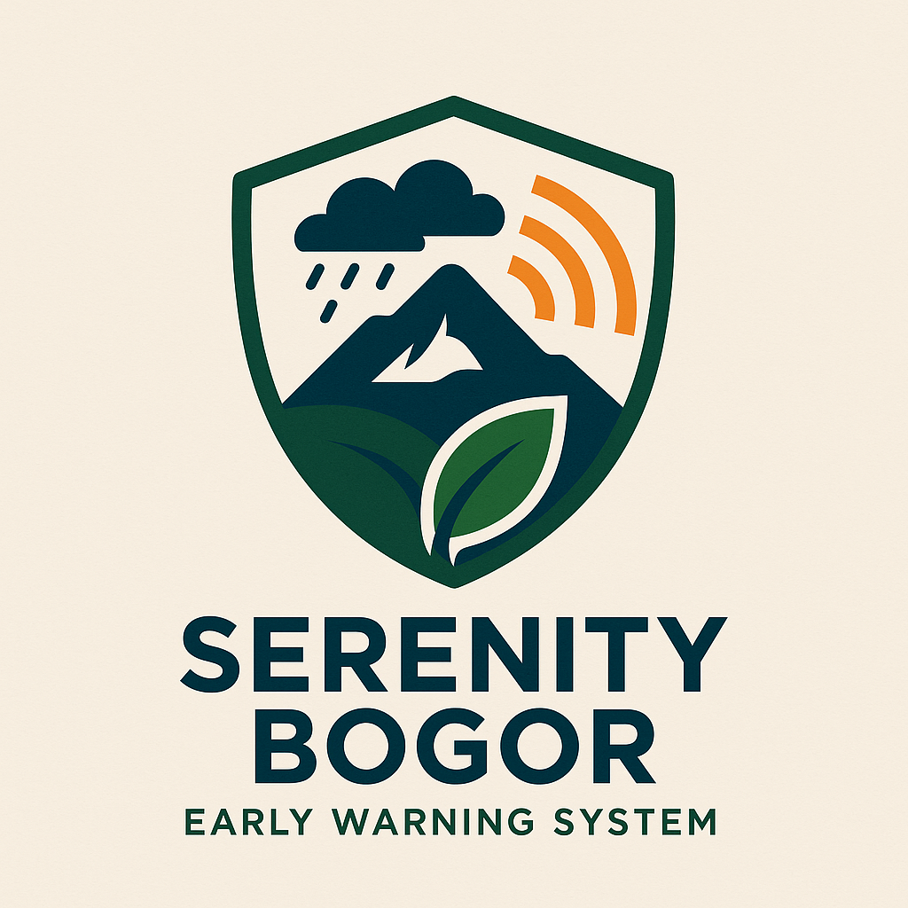

# Serenity EWS Bogor - Early Warning System



**Serenity EWS Bogor** is a comprehensive Early Warning System (EWS) designed to provide timely and accurate information about weather and potential natural disasters in the Bogor City and Regency areas. Built with modern web technologies and powered by Generative AI, this application aims to enhance community preparedness and safety.

## ✨ Key Features

-   **Real-time Weather Monitoring**: Get current weather conditions and a 7-day forecast for Bogor City and Regency.
-   **AI-Powered Recommendations**: Receive daily AI-generated suggestions for activities and clothing based on the weather forecast.
-   **Multi-Disaster Information Pages**: Dedicated dashboards for monitoring:
    -   🌊 **Floods**: Tracks water levels at key dams like Katulampa.
    -   🌍 **Earthquakes**: Shows the latest seismic activity details.
    -   ⛰️ **Landslides**: Assesses and displays current landslide risks.
    -   🔥 **Fires**: Reports on active fire incidents.
    -   🌋 **Volcanoes**: Monitors the status of nearby volcanoes like Mount Salak.
    -   🌪️ **Whirlwinds/Typhoons**: Provides alerts on tropical storms.
-   **Nearby Hazard Alerts**: Uses your device's location to provide real-time, personalized safety alerts if you are near a potential hazard.
-   **Community Reporting**: A crowd-sourcing platform for citizens to report incidents with photos and descriptions. Reports are analyzed and summarized by AI.
-   **Annual Disaster Reports**: Interactive charts and AI-driven trend analysis of disaster data by year and location (Bogor City/Regency).
-   **Bilingual Support**: Fully available in both English and Indonesian.

## 🛠️ Tech Stack

-   **Framework**: [Next.js](https://nextjs.org/) (with App Router)
-   **Language**: [TypeScript](https://www.typescriptlang.org/)
-   **UI**: [React](https://react.dev/), [ShadCN UI](https://ui.shadcn.com/), [Tailwind CSS](https://tailwindcss.com/)
-   **Generative AI**: [Google AI & Genkit](https://firebase.google.com/docs/genkit)
-   **Database**: [PostgreSQL](https://www.postgresql.org/)
-   **Deployment**: [Firebase App Hosting](https://firebase.google.com/docs/app-hosting) (or any Node.js compatible platform)

## 🚀 Getting Started

Follow these instructions to get a copy of the project up and running on your local machine for development and testing purposes.

### Prerequisites

-   [Node.js](https://nodejs.org/) (v18 or newer)
-   [npm](https://www.npmjs.com/) or [yarn](https://yarnpkg.com/)
-   [PostgreSQL](https://www.postgresql.org/download/) database running locally or accessible.

### Installation & Setup

1.  **Clone the repository:**
    ```bash
    git clone https://github.com/sazwarriyadhs/SerenityEWS.git
    cd SerenityEWS
    ```

2.  **Install dependencies:**
    ```bash
    npm install
    ```

3.  **Set up environment variables:**
    Create a `.env` file in the root of the project. Fill in your details as shown below.

    ```dotenv
    # Google AI API Key for Genkit
    GOOGLE_API_KEY=YOUR_GOOGLE_AI_API_KEY

    # PostgreSQL Database Connection
    DB_USER=postgres
    DB_HOST=localhost
    DB_DATABASE=serenityews
    DB_PASSWORD=postgres
    DB_PORT=5432
    ```
    *Replace `YOUR_GOOGLE_AI_API_KEY` with your actual key from [Google AI Studio](https://aistudio.google.com/app/apikey).*

4.  **Set up the database:**
    -   Make sure your PostgreSQL server is running.
    -   Create a new database named `serenityews`.
    -   Connect to your new database and run the SQL commands in `schema.sql` to create the necessary `reports` table.
    
    Example using `psql`:
    ```bash
    psql -U postgres -d serenityews -a -f schema.sql
    ```

5.  **Run the development server:**
    The application will be available at `http://localhost:3000`.
    ```bash
    npm run dev
    ```

6.  **(Optional) Run the Genkit Developer UI:**
    To inspect and test your AI flows separately, run the Genkit development UI in a separate terminal. It will be available at `http://localhost:4000`.
    ```bash
    npm run genkit:dev
    ```

## 📂 Project Structure

-   `src/app/`: Contains all the pages and routes for the application, following the Next.js App Router structure.
-   `src/components/`: Shared React components used across the application, including UI components from ShadCN.
-   `src/ai/`:
    -   `flows/`: All Genkit AI flows are defined here. Each file typically encapsulates a single AI-driven task.
    -   `genkit.ts`: Genkit configuration file.
-   `src/lib/`:
    -   `db.ts`: PostgreSQL database connection setup.
    -   `utils.ts`: Shared utility functions.
    -   `*.ts`: Mock data sources and type definitions for various disaster types (e.g., `weather.ts`, `earthquake.ts`).
-   `src/contexts/`: React Context providers, such as the `LanguageProvider`.
-   `src/locales/`: JSON files for internationalization (i18n) strings (English and Indonesian).
-   `public/`: Static assets, including the application logo.
-   `schema.sql`: The SQL schema for the database tables.

---

This project was developed within Firebase Studio.
